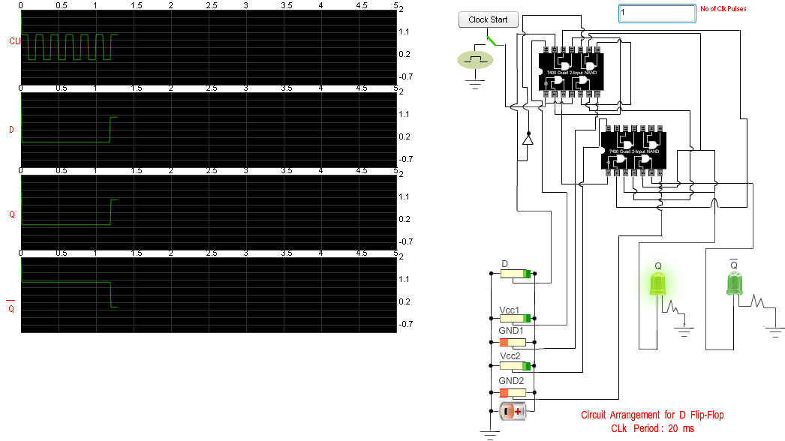
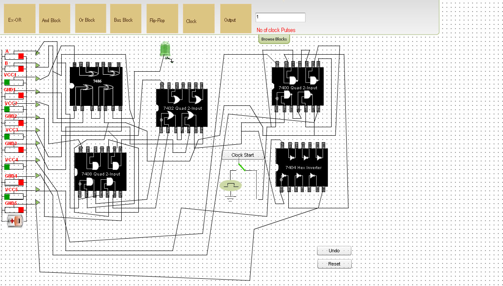

### Procedure

                            
                            

Please follow these steps to do the experiment.

                             
                             
                            
<ul style="list-style:none">
 
<li class="expt1"> 1.&nbsp; At first apply high voltage to Vcc1&nbsp;&amp;&nbsp;Vcc2.So that the "Clock Start" button will be enabled. 
   
  </ul>    
     
    </li>                      
  
                    
 
                               
                              
<ul style="list-style:none">
 
<li class="expt1"> 2.&nbsp;  Next, start the clock pulse by clicking on the "Clock Start" button and after generation of some clock pulses stop the clock pulse by clicking on the"clock Stop" button .  
    
</ul>    
     
    </li>                      
  
  
                               
                                 
                                 
                               
                                                       
<ul style="list-style:none">
 
 <li class="expt1"> 3.&nbsp;  Now apply high voltage to S input and low voltage to R input and set "No of clock pulses" to 1.See the changes at output(Q and Q) at positive clock edge. 
    
 </ul>    
     
    </li>                      
   
  
                                
                                 
                                 
 <ul style="list-style:none">
 
 <li class="expt1"> 4.&nbsp;  Now apply high voltage to R input and low voltage to S input and start the clock pulse.See the changes at output(Q and Q) at positive clock edge.  
    
</ul>    
     
    </li>                      
   
  
                               
                                 
                                 
                               
 <ul style="list-style:none">
    <li class="expt1"> 5.&nbsp;  Next,apply low voltage to both the inputs(S and R) and start the clock pulse again.See the changes at output(Q and Q) at positive clock edge.  
    
</ul>    
     
    </li>                      
   
   
                             
                               
  
                                 
								
<ul style="list-style:none">
    <li class="expt1"> 6.&nbsp;  Next,apply high voltage to both the inputs(S and R) and start the clock pulse again.See both the outputs(Q and Q) will be zero.It is "not allowed" condition.  
    
</ul>    
     
    </li>                      
   
  
                             
							  
                               
								
 
Please follow these steps to do the experiment(Part-II)

 

 <ul style="list-style:none">
 
<li class="expt1"> 1.&nbsp; At first apply high voltage to Vcc1&nbsp;&amp;&nbsp;Vcc2.So that the "Clock Start" button will be enabled. 
   
</ul>    
     
    </li>                      
  
                                 
                               
 <ul style="list-style:none">
 
<li class="expt1"> 2.&nbsp;  Next, start the clock pulse by clicking on the "Clock Start" button and after generation of some clock pulses stop the clock pulse by clicking on the"clock Stop" button .  
    
</ul>    
     
    </li>                      
  
 
                               
                                 
                                 
                               
                                                       
 <ul style="list-style:none">
 
 <li class="expt1"> 3.&nbsp;  Now apply high voltage to J input and low voltage to K input and set "No of clock pulses" to 1.See the changes at output(Q and Q) at positive clock edge. 
    
 </ul>    
     
    </li>                      
   
  
                                
                                 
                                 
                             
<ul style="list-style:none">
 
 <li class="expt1"> 4.&nbsp;  Now apply high voltage to K input and low voltage to J input and start the clock pulse.See the changes at output(Q and Q) at positive clock edge.  
    
 </ul>    
     
    </li>                      
   
  
                               
                                 
                                 
                               
 <ul style="list-style:none">
    <li class="expt1"> 5.&nbsp;  Next,apply low voltage to both the inputs(J and K) and start the clock pulse again.See the changes at output(Q and Q) at positive clock edge.  
    
 </ul>    
     
    </li>                      
   
  
                             
                               
  
                                 
								
<ul style="list-style:none">
    <li class="expt1"> 6.&nbsp;  Next,apply high voltage to both the inputs(J and K) and start the clock pulse again.See both the outputs(Q and Q) will toggle at positive clock edge.  
    
</ul>    
     
    </li>                      
   
  
                             
							  
                              
								
        
 
Please follow these steps to do the experiment(Part-III)

                           

 <ul style="list-style:none">
 
<li class="expt1"> 1.&nbsp; At first apply high voltage to Vcc1&nbsp;&amp;&nbsp;Vcc2.So that the "Clock Start" button will be enabled. 
   
</ul>    
     
    </li>                      
  
                                 
                               
 <ul style="list-style:none">
 
<li class="expt1"> 2.&nbsp;  Next, start the clock pulse by clicking on the "Clock Start" button and after generation of some clock pulses stop the clock pulse by clicking on the"clock Stop" button .  
    
 </ul>    
     
    </li>                      
  
 
                               
                                 
                                 
                               
                                                       
 <ul style="list-style:none">
 <li class="expt1"> 3.&nbsp;  Now apply high voltage to D input and set "No of clock pulses" to 1.See the changes at output(Q and Q) at positive clock edge. 
    
</ul>    
     
    </li>                      
   
  
                                
                                 
                                 
                             
 <ul style="list-style:none">
 
 <li class="expt1"> 4.&nbsp;  Now apply low voltage to D input and start the clock pulse.See the changes at output(Q and Q) at positive clock edge.  
    
 </ul>    
     
    </li>                      
   
  
                               
                                 
                                 
								
								
								
                                
        

Please follow these steps to do the experiment(Part-IV)

                           

 <ul style="list-style:none">
 
 <li class="expt1"> 1.&nbsp; At first click on the "Browse Block" button. 
   
 </ul>    
     
    </li>                      
  
                                 
                               
                              
  <ul style="list-style:none">
 
<li class="expt1"> 2.&nbsp;  Next, click on the Ex-or block .  
    
</ul>    
     
    </li>                      
  
  
                               
                                 
                                 
                               
 <ul style="list-style:none">
 
<li class="expt1"> 3.&nbsp;  Now drag the Ex-or block and place it on the bread board. 
    
 </ul>    
     
    </li>                      
   
  
                                
                                 
                                 
                             
<ul style="list-style:none">
 
 <li class="expt1"> 4.&nbsp;  In the same way drag all the blocks and place them on the bread board according to the following manner.  
    
</ul>    
     
    </li>                      
   
  
                               
                                 
                                 
					  <ul style="list-style:none">
    <li class="expt1"> 5.&nbsp;  Next,click on the first node of the "Bus Block" and start to make a connection with the first pin of the Ex-or Block.  
    
 </ul>    
     
    </li>                      
   
  
                             
                               
  
                                 
								
<ul style="list-style:none">
    <li class="expt1"> 6.&nbsp;  Now conection with the first pin of the Ex-or block is completed .  
    
</ul>    
     
	</li>
	
 
                               
                                 
                                 
								
								 
								 
								
<ul style="list-style:none">
    <li class="expt1"> 7.&nbsp; In the same way we can proceed in making circuit connection.  
    
 </ul>    
     
	</li>
	
 
                               
                                 
                                 
								
								 
								 
								<ul style="list-style:none">
    <li class="expt1"> 8.&nbsp; Now Circuit connection is completed. In this circuit connection sixth pin of NAND block is connected to the fifth pin
	of Ex-or block.Here output of D Flip-Flop is fed to the Cin input of the combinational circuit(one bit full adder). 
    
</ul>    
     
	</li>
	 
								
								 
								 
								
<ul style="list-style:none">
    <li class="expt1"> 9.&nbsp; Next, apply high voltage to Vcc1, Vcc2, Vcc3, Vcc4, Vcc5 and also apply low volage to GND1, GND2, GND3, GND4, GND5 and set No of clock pulses to 1.So only one clock pulse is generated and then clock is stopped.Apply low voltage to both the inputs A and B and start the clock pulse.One clock pulse is generated and S = 0, Cout = 0.Because at this clock edge Cin = 0(Cin = Cout of previous clock edge).  
    
</ul>    
     
	</li>
	 
								
								 
								 
								
<ul style="list-style:none">
    <li class="expt1"> 10.&nbsp; Apply high voltage to both the inputs A and B and start the clock pulse.One clock pulse is generated and S = 0, Cout = 1.Because at this clock edge Cin = 0(Cin = Cout of previous clock edge).  
    
</ul>    
     
	</li>
	 
								
								 
								 
								
<ul style="list-style:none">
    <li class="expt1"> 11.&nbsp; Again start the clock pulse.Now S= 1, Cout = 1.Because at this clock edge Cin = 1(Cin = Cout of previous clock edge).  
    
</ul>    
     
	</li>
	 
								
								 
								 
								
<ul style="list-style:none">
    <li class="expt1"> 12.&nbsp; Next apply low voltage to both the inputs A and B.Again start the clock pulse.Now S= 1, Cout = 0.Because at this clock edge Cin = 1(Cin = Cout of previous clock edge). 
    
 </ul>    
     
	</li>
	 
								
								 
								 
                               
<ul style="list-style:none">
    <li class="expt1"> 13.&nbsp; Again start the clock pulse.In this clock edge we will see S = 0,  Cout = 0.Because at this clock edge Cin = 0(Cin = Cout of previous clock edge).  
    
</ul>    
     
	</li>
	 
								
								 
								 
								
 <ul style="list-style:none">
    <li class="expt1"> 14.&nbsp; We can verify the outputs(S and Cout) for all the combinations of A, B, Cin.  
    
 </ul>    
     
	</li>
	 
                            
                        
