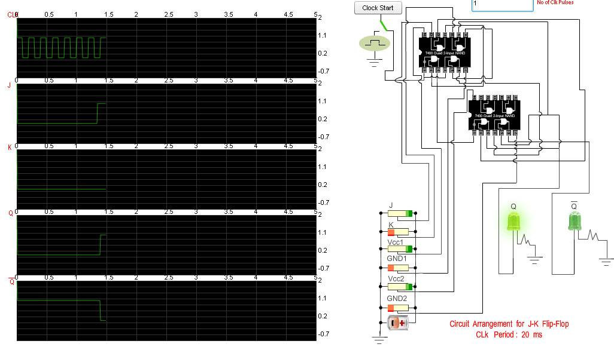
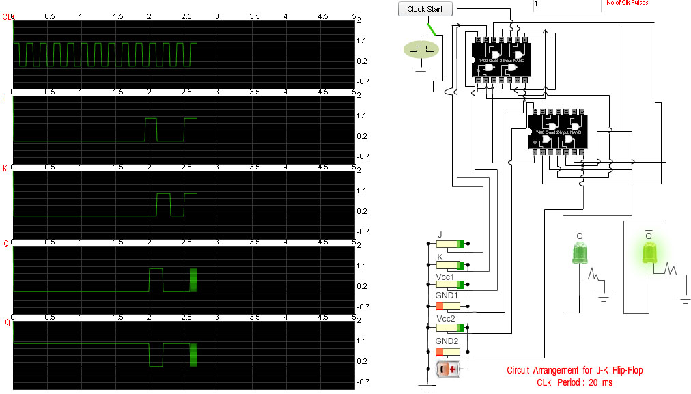

## Procedure
                        
#### Please follow these steps to do the experiment.
                            
1. At first apply high voltage to Vcc1&nbsp;&amp;&nbsp;Vcc2.So that the "Clock Start" button will be enabled.                 

                    
 2. Next, start the clock pulse by clicking on the "Clock Start" button and after generation of some clock pulses stop the clock pulse by clicking on the"clock Stop" button .  
    
    
  

3. Now apply high voltage to S input and low voltage to R input and set "No of clock pulses" to 1.See the changes at output(Q and Q) at positive clock edge. 
    
 
 

4.  Now apply high voltage to R input and low voltage to S input and start the clock pulse.See the changes at output(Q and Q) at positive clock edge.  
    

5.  Next,apply low voltage to both the inputs(S and R) and start the clock pulse again.See the changes at output(Q and Q) at positive clock edge.  
    

                               
 6. Next,apply high voltage to both the inputs(S and R) and start the clock pulse again.See both the outputs(Q and Q) will be zero.It is "not allowed" condition.  
    

						
                        
#### Please follow these steps to do the experiment(Part-II)

1. At first apply high voltage to Vcc1&nbsp;&amp;&nbsp;Vcc2.So that the "Clock Start" button will be enabled.
   

                        
2.  Next, start the clock pulse by clicking on the "Clock Start" button and after generation of some clock pulses stop the clock pulse by clicking on the"clock Stop" button .  
    

3.  Now apply high voltage to J input and low voltage to K input and set "No of clock pulses" to 1.See the changes at output(Q and Q) at positive clock edge. 
    
 
                    
4. Now apply high voltage to K input and low voltage to J input and start the clock pulse.See the changes at output(Q and Q) at positive clock edge.  
    

                                
5. Next,apply low voltage to both the inputs(J and K) and start the clock pulse again.See the changes at output(Q and Q) at positive clock edge.  
    
 
                               
 6.  Next,apply high voltage to both the inputs(J and K) and start the clock pulse again.See both the outputs(Q and Q) will toggle at positive clock edge.  
    

							 
#### Please follow these steps to do the experiment(Part-III)
                          
1.  At first apply high voltage to Vcc1&nbsp;&amp;&nbsp;Vcc2.So that the "Clock Start" button will be enabled. 

                    
2.  Next, start the clock pulse by clicking on the "Clock Start" button and after generation of some clock pulses stop the clock pulse by clicking on the"clock Stop" button . 

                               
3.  Now apply high voltage to D input and set "No of clock pulses" to 1.See the changes at output(Q and Q) at positive clock edge.

                                
4.  Now apply low voltage to D input and start the clock pulse.See the changes at output(Q and Q) at positive clock edge.  
    

                        
