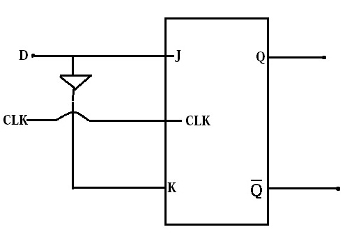

###  Theory 
 
                            
             Sequential Circuits:&nbsp; The logic circuits whose outputs at any instant of time depend not only on the present input but also
			 on the past outputs are called sequential circuits.  
			 The simplest kind of sequential circuit which is capable of storing one bit of information is called latch.The operation of basic 
			 latch can be modified, by providing an additional control input that determines, when the state of the circuit is to be changed. 
			 The latch with additional control input is called the Flip-Flop.The additional control input is either the clock or enable input. 
			  
			 Different types of Flip-Flop:&nbsp; There are four basic types, namely, S-R, J-K, D and T Flip-Flops. 
			 
  
           
             
 S-R Flip-Flop 

                      
 
                            

                             
                             
                             Figure 1:&nbsp;Clocked NOR-based S-R Flip-Flop                            
                             
                             
                             

                             

                             
                             
                            Figure 2:&nbsp;NAND-based S-R Flip-Flop
                             
                             
                             

                             

                             
                             
                            Figure 3:&nbsp;Typical wave-form in S-R Flip-Flop
                             
                             
                             

                             

                             
                             
                            Figure 4:&nbsp;S-R Flip-Flop characteristic Table
                             
                             
                             

                             NOTE :: &nbsp;clk, S and R signals are input signals  
                             
 Q  and Q  : Output signals
                              
   
 

                            
 J-K Flip-Flop 

                            

   
                            

                             
                             
                            Figure 1:&nbsp;J-K Flip-Flop using S-R Flip-Flop
                             
                             
                             

                              
                             

                             
                             
                            Figure 2:&nbsp;NAND based J-K Flip-Flop 
                             
                             
                             

                              
                             

                             
                             
                            Figure 3:&nbsp;Typical wave-form in J-K Flip-Flop 
                             
                             
                             

                              
                             

                             
                             
                            Figure 4:&nbsp;J-K Flip-Flop characteristic Table
                             
                             
                             

                             
 D Flip-Flop 
 
                             

  
  

                            
                              
                            Figure 1:&nbsp;D Flip-Flop
                            

                             
                             

                             
                             
                            Figure 2:&nbsp;NAND-based D Flip-Flop
                             
                             
                             

                              
                             

                             
                             
                            Figure 3:&nbsp;D Flip-Flop characteristic Table
                             
                             
                             

                              
 Synthesis using Flip-Flop  
 
                            
&nbsp; As a simple exersise,students can verify the operation of a serial (sequential)adder(1 bit full adder)
							Carry output of a one bit full adder can be fed back to the input of a D Flip-Flop.The output of this Flip=Flop can be fed back to the carry input of that adder. 

  
  

                            
                              
                           Figure 1:&nbsp;Verification of the functionality of a combinational circuit using seqential element(Flip-Flop)
                            

            	 
				

                            
                              
                            Figure 2:&nbsp;Gate diagram of combinational circuit(1 bit full adder)
                            

							 
  

                            
                              
                            Figure 3:&nbsp;Truth table of a 1 bit fulladder                            
                        
