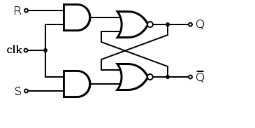
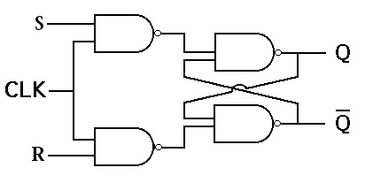
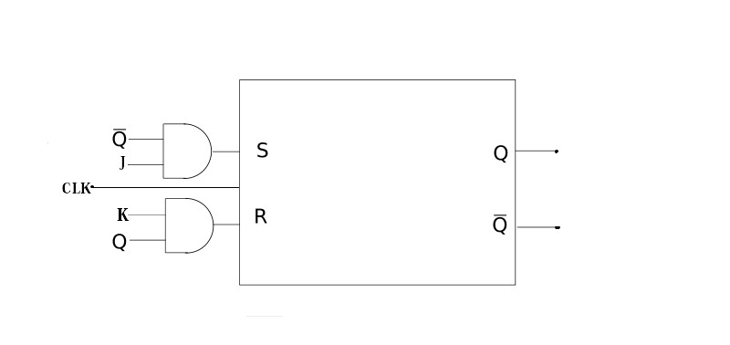
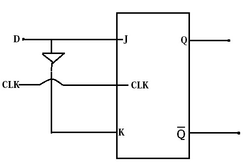
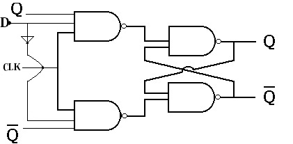
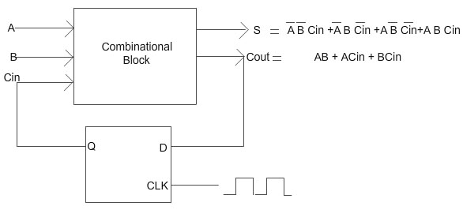
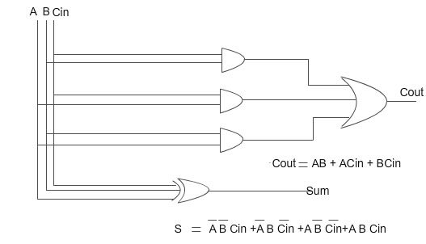

## Introduction

**About the Experiment**

This experiment enables a student to learn

- How to realize the functionality of sequential circuits using basic flip-flops
- How to verify the operation of a combinational circuit using flip-flop(D Flip-Flop)

## Theory

Sequential Circuits: The logic circuits whose outputs at any instant of time depend not only on the present input but also
on the past outputs are called sequential circuits. The simplest kind of sequential circuit which is capable of storing one bit of information is called latch.The operation of basic latch can be modified, by providing an additional control input that determines, when the state of the circuit is to be changed. The latch with additional control input is called the Flip-Flop.The additional control input is either the clock or enable input.
	
Different types of Flip-Flop: There are four basic types, namely, S-R, J-K, D and T Flip-Flops. 
			 
#### S-R Flip-Flop 

   
    
Figure 1:Clocked NOR-based S-R Flip-Flop                            

   
    
Figure 2:NAND-based S-R Flip-Flop
                          

   
    
Figure 3:Typical wave-form in S-R Flip-Flop

   
    
Figure 4:S-R Flip-Flop characteristic Table

**NOTE :** clk, S and R signals are input signals 
                             
 Q  and Q  : Output signals
                            

#### J-K Flip-Flop 

     
    
Figure 1:J-K Flip-Flop using S-R Flip-Flop

                         
   

                            

     
  
Figure 2:NAND based J-K Flip-Flop 

                           

     
      
Figure 3:Typical wave-form in J-K Flip-Flop 

                           

   
    
Figure 4:&nbsp;J-K Flip-Flop characteristic Table

        
        
####  D Flip-Flop 
                            
  

                            
                            

                            Figure 1:&nbsp;D Flip-Flop

                            

                          

                             
                            

                            Figure 2:NAND-based D Flip-Flop 

                           

                          

                             
                           
 Figure 3:D Flip-Flop characteristic Table

                            

                            
#### Synthesis using Flip-Flop  

As a simple exersise,students can verify the operation of a serial (sequential)adder(1 bit full adder) Carry output of a one bit full adder can be fed back to the input of a D Flip-Flop.The output of this Flip=Flop can be fed back to the carry input of that adder.

  

                            
                              
                           
Figure 1:Verification of the functionality of a combinational circuit using seqential element(Flip-Flop)

                            

            	 
				

                            
                              
                            
Figure 2:Gate diagram of combinational circuit(1 bit full adder)

                            

							 
  

                            
                              
                           
 Figure 3:Truth table of a 1 bit fulladder      
                      
   
